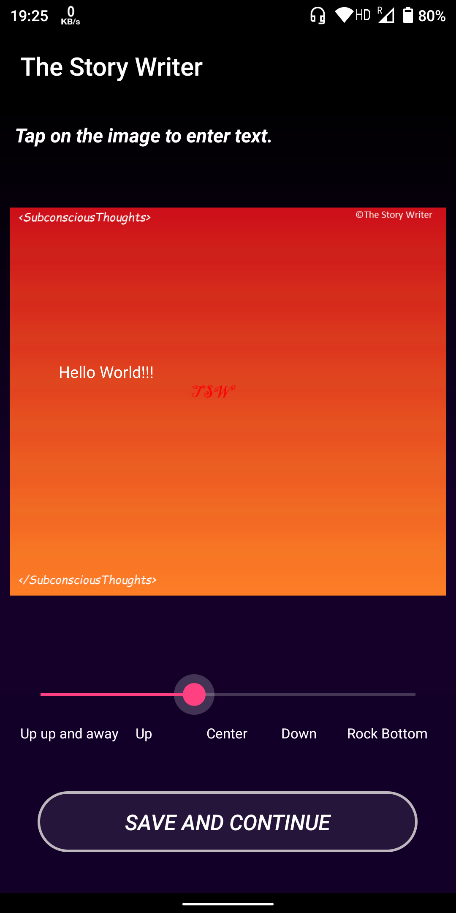

# The Story Writer

  

This app is a light spin-off of the [Terribly Dank Tales](https://www.facebook.com/terriblydanktalestdt/), but in mobile version,
and also the 1st app that led to the starting of my Android Career.

Enough about me, what **The Story Writer** can do:

    

* Create your own short stories from the pre-defined templates and make memes or speak your heart out, and finally save it!

  
    
    

* Share your stories across all social media platforms.

  
    
  
   
   

* Create something new daily. It's like your personal diary, but colourful!

   

Check out the latest edition of this app [The Story Writer V2](https://github.com/Projit32/TheStoryWriter-V2)
